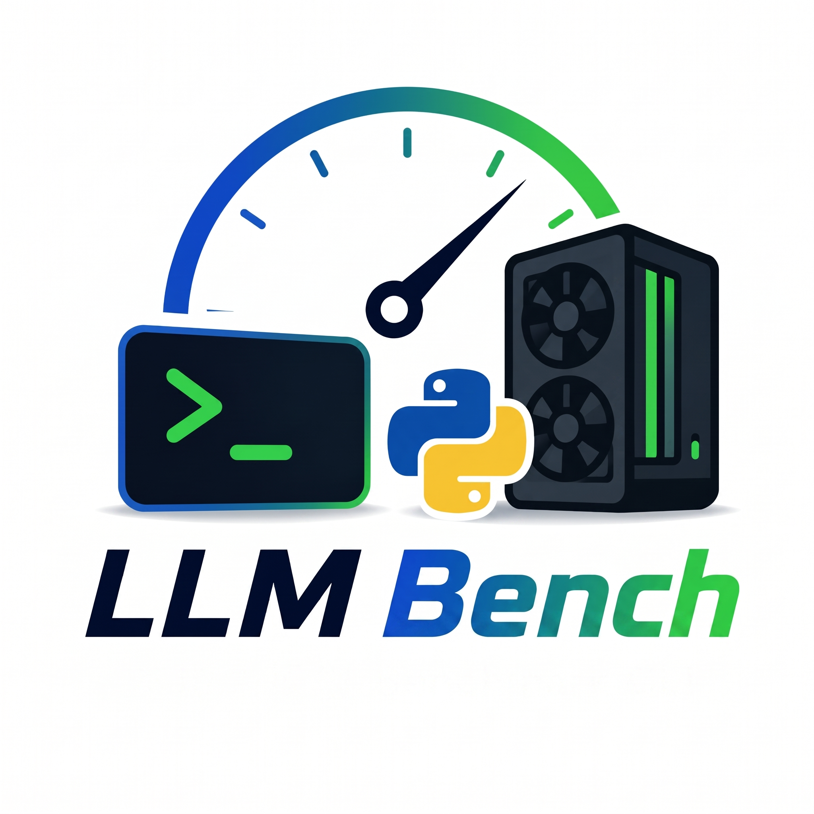

# llm-bench



> **本地大模型推理与 NCCL 通信 benchmark 一站式命令行工具**

---

## 📌 目录
- [项目简介](#-项目简介)
- [核心特性](#-核心特性)
- [安装指南](#-安装指南)
- [快速开始](#-快速开始)
- [核心概念与规则](#-核心概念与规则)
- [典型运行示例](#-典型运行示例)
- [YAML 配置文件](#-yaml-配置文件)
- [报告产物与指标解读](#-报告产物与指标解读)
- [高级功能](#-高级功能)
- [设计原则与不支持项](#-设计原则与不支持项)

---

## 📖 项目简介

`llm-bench` 旨在简化本地大语言模型（LLM）推理后端（如 vLLM, SGLang, Transformers）以及 GPU NCCL 通信的性能压测。

在跑 Benchmark 时，你是否觉得处理容器启动、端口映射、卷挂载、环境变量注入、指标采集和报告生成等繁琐流程很痛苦？`llm-bench` 就是为了解决这些痛点而生的。它**只负责外围的生命周期管理与数据统计，将核心的启动命令完整控制权交还给你**。

---

## ✨ 核心特性

- **零侵入参数传递**：容器内跑什么命令，完全由你在 `--` 后面原样书写，工具不翻译、不重命名参数。
- **自动容器管理**：自动启动容器、映射端口、挂载 Hugging Face 缓存目录、注入 `HF_TOKEN`。
- **全方位指标采集**：集成 OpenAI 协议压测客户端，实时采集 GPU 指标（利用率、显存、温度、功耗）。
- **专业报告生成**：自动输出 Markdown 报告、度量折线图（PNG）以及详细的 JSONL 原始数据，支持历史结果对比以及 CI 回归阈值检查（门禁模式）。

---

## 📥 安装指南

支持多种运行与安装方式：

### 1. 使用 pip 安装
```bash
pip install .
llm-bench --help
```

### 2. 源码直接运行
```bash
python -m llm_bench --help
```

### 3. 打包成单文件二进制（适合无 Python 环境的测试机）
```bash
bash scripts/build_binary.sh
./dist/llm-bench --help
```

---

## 🚀 快速开始

如果不熟悉参数怎么写，可以使用**交互式向导（Wizard）**：

```bash
llm-bench wizard
```
只需 8 步，即可完成配置并预览/运行完整的 `docker run` 命令。支持使用 `b` / `←` / `Backspace` 随时回退上一步。

---

## 💡 核心概念与规则

为了灵活且互不干扰地传递参数，`llm-bench` 的命令行参数设计遵循以下原则：

```bash
llm-bench [command] [工具自身的参数] -- [真实的容器内启动命令]
```

* **`--` 前面**：控制工具自身行为（如起哪个镜像、如何发送压测请求、报告写到哪里）。
* **`--` 后面**：真实的容器内命令。相当于在宿主机上执行 `docker run ... <image> [后面这串命令]`。

> [!TIP]
> **关于 `--docker-arg` 的传参方式**
> 当你想传递以 `--` 开头的 Docker 参数时，请务必使用 `=` 连接符，否则会被命令行解析器误解：
> * `❌ 正确但易错`: `--docker-arg --shm-size --docker-arg 16g`
> * `✅ 推荐写法`: `--docker-arg=--shm-size=16g`

### 工具自动注入的 Docker 参数一览

当使用 vLLM 或 SGLang 后端时，工具会在后台自动拼装并注入以下参数：

| 自动注入项 | 触发条件 / 对应参数 | 说明 |
| :--- | :--- | :--- |
| `--rm` | 默认开启 | 运行结束自动清理容器。可用 `--keep-container` 关闭 |
| `--name llm-bench-<backend>-<timestamp>` | 总是注入 | 唯一的容器运行名称 |
| `-p <port>:<port>` | 通过 `--port` 指定 | 宿主机与容器端口映射 |
| `-v <hf_cache>:/root/.cache/huggingface` | 通过 `--hf-cache`（默认 `~/.cache/huggingface`） | 挂载本地 HF 缓存，避免重复下载 |
| `-e HF_HOME=/root/.cache/huggingface` | 总是注入 | 指定容器内 HF 缓存路径 |
| `-e HF_TOKEN` / `HUGGING_FACE_HUB_TOKEN` | 通过 `--hf-token` 或读取宿主机环境变量 | 注入 Hugging Face Token |
| `--gpus` / `--shm-size` / `--ipc=host` | 通过 `--docker-arg=...` 自行指定 | 工具**不预设**任何 GPU/共享内存参数，请显式声明 |

---

## 📝 典型运行示例

### 1. vLLM 推理压测 (Docker 模式)
```bash
llm-bench infer \
  --backend vllm \
  --image vllm/vllm-openai:latest \
  --model-name Qwen/Qwen2.5-7B-Instruct \
  --port 8000 \
  --workload-profile quick \
  --docker-arg=--gpus=all \
  --docker-arg=--shm-size=16g \
  --docker-arg=--ipc=host \
  -- \
  /root/.cache/huggingface/hub/models--Qwen--Qwen2.5-7B-Instruct/snapshots/<hash> \
    --host 0.0.0.0 --port 8000 \
    --tensor-parallel-size 2 \
    --gpu-memory-utilization 0.9 \
    --max-model-len 4096
```

### 2. SGLang 推理压测 (Docker 模式)
```bash
llm-bench infer \
  --backend sglang \
  --image lmsysorg/sglang:latest \
  --model-name Qwen/Qwen2.5-7B-Instruct \
  --port 30000 \
  --workload-profile quick \
  --docker-arg=--gpus=all \
  --docker-arg=--shm-size=32g \
  --docker-arg=--ipc=host \
  -- \
  python3 -m sglang.launch_server \
    --model-path /root/.cache/huggingface/hub/models--Qwen--Qwen2.5-7B-Instruct/snapshots/<hash> \
    --host 0.0.0.0 --port 30000 \
    --tp 2
```

### 3. Transformers 推理压测 (本地进程模式)
> [!NOTE]
> Transformers 后端运行在当前 Python 进程内（不使用 Docker，不启动 HTTP 服务），因此**不需要也不接受** `--` 后置容器命令。其参数直接对齐 `AutoModelForCausalLM` 方法。

```bash
llm-bench infer \
  --backend transformers \
  --model-path /mnt/models/Qwen2.5-7B-Instruct \
  --torch-dtype bfloat16 \
  --device-map cuda:0 \
  --quantization 4bit \
  --trust-remote-code \
  --do-sample \
  --temperature 0.7 --top-p 0.9 \
  --batch-size 2 \
  --total-requests 16 \
  --workload-profile quick
```

### 4. NCCL 通信测试 (All-Reduce)
```bash
llm-bench comm all-reduce \
  --image nccl-tests:latest \
  --docker-arg=--gpus=all \
  --docker-arg=--shm-size=16g \
  --docker-arg=--ipc=host \
  -- \
  /opt/nccl-tests/build/all_reduce_perf -b 8 -e 1G -f 2 -g 8 -n 100 -w 20
```

---

## ⚙️ YAML 配置文件

除命令行外，你也可以将所有配置写入 YAML 文件中以便复用：

```yaml
backend:
  name: vllm
  image: vllm/vllm-openai:latest
  port: 8000
  model_name: Qwen/Qwen2.5-7B-Instruct
  hf_cache: ~/.cache/huggingface
  docker_args:
    - --gpus
    - all
    - --shm-size
    - 16g
    - --ipc=host
  command:
    - /root/.cache/huggingface/hub/models--Qwen--Qwen2.5-7B-Instruct/snapshots/<hash>
    - --host
    - 0.0.0.0
    - --port
    - "8000"
    - --tensor-parallel-size
    - "2"
    - --gpu-memory-utilization
    - "0.9"
    - --max-model-len
    - "4096"

workload:
  profile: quick
  api: completions
  stream: false
  prompt_dir: examples/prompts

report:
  output_dir: benchmark_output/runs
```

执行命令：
```bash
llm-bench infer --config configs/inference.yaml
```

---

## 📊 报告产物与指标解读

### 1. 产物目录结构
每次运行结束后，将在配置的输出目录下生成结构化的度量文件：

```text
benchmark_output/runs/<run_id>/
├── config.requested.yaml         # 本次请求指定的字段
├── config.resolved.yaml          # 合并后生效的完整配置
├── run_manifest.json             # 汇总运行元信息与关键指标
├── environment.json              # 运行环境（CPU/Docker/GPU 等）
├── metrics.summary.json          # 全局聚合指标（按 Workload 分组）
├── metrics.requests.jsonl        # 每个请求的详细度量明细
├── metrics.gpu.jsonl             # GPU 采样数据时序记录
├── launch_plan.sh                # 实际执行的完整 docker run 命令备份
├── logs/
│   └── backend.log               # 容器内合并后的 stdout + stderr 日志
└── reports/
    ├── inference_report.md       # 可读的 Markdown 性能报告
    └── images/*.png              # 性能曲线与 GPU 监控图表
```

### 2. 关键性能指标说明
在 `inference_report.md` 中，以下指标最为关键：

| 指标 | 计算公式 / 来源 | 解读与应用场景 |
| :--- | :--- | :--- |
| **Output TPS (system)** | $\sum \text{output\_tokens} / \text{实际墙钟时间}$ | **LLM 吞吐主指标**。多并发下比 QPS 更具参考价值（能有效避免 Token 长度不均造成的统计失真）。 |
| **Decode TPS (per req)** | $1000 / \text{TPOT(ms)}$ | 单个请求的解码速度，即用户体感上的**“打字机速度”**。聊天场景核心关注。 |
| **Prefill TPS (per req)**| $\text{input\_tokens} / \text{TTFT(s)}$ | 单个请求的首阶段填充速度。长文本 / RAG / Agent 场景核心关注。 |
| **Input TPS (system)** | $\sum \text{input\_tokens} / \text{实际墙钟时间}$ | 系统整体每秒消化的输入 Token 数。适合 Input $\gg$ Output 的场景。 |
| **TTFT p99** | 首个 Token 到达时间的 99 分位数 | 首字延迟的尾部表现（首字响应慢不慢）。 |
| **TPOT p99** | Token 间平均耗时的 99 分位数 | 解码阶段的尾部波动表现（打字是否卡顿）。 |
| **E2E p99** | 端到端请求总耗时的 99 分位数 | 请求全生命周期的尾部延迟。 |
| **busbw / algbw (NCCL)** | 来自 nccl-tests 的输出 | 通信总线带宽。建议观察大包（$\ge 64\text{MB}$）下的表现是否接近物理带宽。 |

---

## 🛠️ 高级功能

### 1. 历史结果对比
```bash
llm-bench list                                          # 列出所有历史运行记录
llm-bench show <run_dir>                                # 查看特定运行的配置与指标
llm-bench compare --baseline A --candidate B            # 对比两次测试并生成对比报告
```

### 2. 自动化门禁 (Gate)
在持续集成中，可以使用 `gate` 命令设置退化阈值。如果候选版本指标退化超标，则返回非零退出码：
```bash
llm-bench gate --baseline A --candidate B \
  --max-output-tps-drop-pct 5 \
  --max-e2e-p99-increase-pct 20
```
你也可以通过 `baseline set <run_dir>` 将特定运行结果标记为该硬件与后端组合下的基准线，随后使用 `--to-baseline` 自动对比。

### 3. 本地自检 (Self-Test)
在没有 GPU/Docker/大模型文件的开发环境下，可使用 self-test 进行工具本身的干跑与链路验证：
```bash
llm-bench self-test --prompt-dir examples/prompts --concurrency 1 --total-requests 3
```

### 4. 日志清理
```bash
llm-bench cleanup \
  --runs-dir benchmark_output/runs \
  --request-metrics-days 30 \
  --gpu-metrics-days 30 \
  --logs-days 14 \
  --no-dry-run
```
> [!NOTE]
> 该命令会清理体积较大的 jsonl 明细和 log 文件，但 `run_manifest.json` 与 `metrics.summary.json` 等关键轻量总结数据将**永久保留**。

---

## ⚠️ 设计原则与不支持项

1. **不翻译参数**：工具对 `--` 后的底层引擎参数（vLLM / SGLang）作原样保留。
2. **环境预检优先**：在启动容器前预检 Docker、可用端口、GPU 状态，避免在容器内运行出错导致等待时间浪费。
3. **失败亦归档**：哪怕环境检查或启动失败，工具也会生成对应的运行目录，保存错误日志以供诊断。
4. **⚠️ 不支持多机 NCCL 自动编排**：若要测试多机 NCCL，请在外部通过 `mpirun` 或各节点手动运行 `llm-bench comm all-reduce`，最后使用 `compare` 汇总报告。
5. **⚠️ 不会自动下载模型与镜像**：测试前必须确保 `docker pull` 和 `huggingface-cli download` 已经就绪。