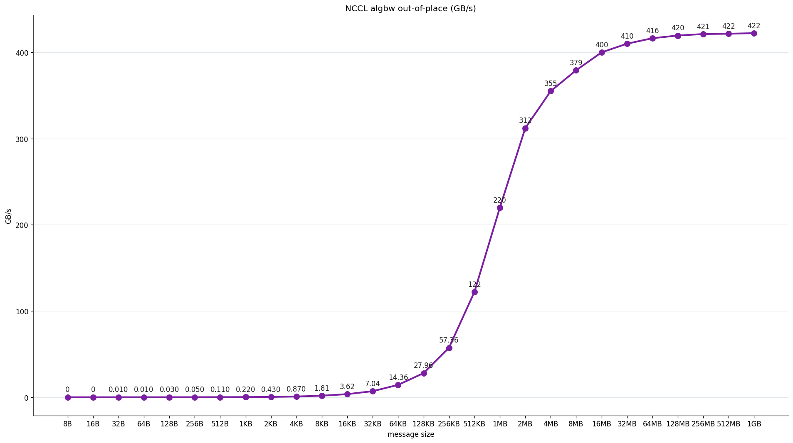
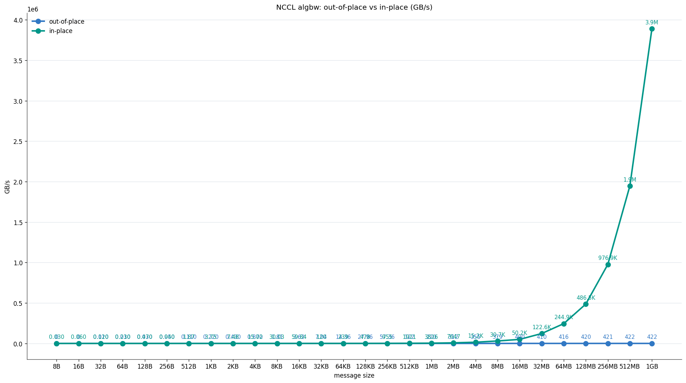

# NCCL All-Reduce 测试报告

> run_id: `20260608_135844_nccl_all_reduce` · image: `ghcr.io/coreweave/nccl-tests:12.2.2-cudnn8-devel-ubuntu22.04-nccl2.23.4-1-2ff05b2` · returncode: `0`

## 关键指标

| metric | value | unit |
|---|---:|---|
| **max busbw (out-of-place)** | `0.0` | GB/s |
| **max busbw (in-place)** | `0.0` | GB/s |
| max algbw (out-of-place) | `422.25` | GB/s |
| max algbw (in-place) | `3890791.84` | GB/s |
| min time | `4.29` | µs |
| largest tested size | `1GB` (`1073741824` bytes) | - |
| busbw @ largest size (out-of-place) | `0.0` | GB/s |
| busbw @ largest size (in-place) | `0.0` | GB/s |
| 非零误差行数 | `0` | rows |

## 启动命令

```bash
/opt/nccl-tests/build/all_reduce_perf -b 8 -e 1G -f 2 -g 1 -n 100 -w 20
```

## 拓扑 / 环境

| field | value | 说明 |
|---|---|---|
| GPU 数 (测试 -g) | `1` | 容器内可见 |
| GPU [0] | `NVIDIA GeForce RTX 3090` | 24576 MiB |
| GPU [1] | `NVIDIA GeForce RTX 3090` | 24576 MiB |
| 主机名 | `worker1` | - |
| 操作系统 | `Linux 5.15.0-181-generic` | - |
| CPU | `Intel(R) Xeon(R) CPU E5-2680 v3 @ 2.50GHz` | 48 cores |
| 内存 | `125` GB | - |
| NVIDIA 驱动 | `580.159.03` | - |
| CUDA 版本 | `13.0` | - |
| GPU 间最强链路 | `NV, PIX, PXB, PHB, SYS` | NV* = NVLink；PIX/PXB = 同 root 的 PCIe；PHB = 跨 root 的 PCIe；SYS = 跨 NUMA |
| 理论 busbw 上限 (参考) | `32.0` GB/s (PCIe 4 x16 (sibling under same root)) | 实测 max 应接近此值；远低于说明软件 / 拓扑 / 配置有瓶颈 |


## 指标含义

- **algbw (algorithm bandwidth)** = 传输字节 / 实测时间。反映**每张卡**看到的数据量。
- **busbw (bus bandwidth)** = `algbw × 2(N−1)/N`（all-reduce ring）。反映 NCCL **实际触达的硬件带宽**——这是判断 NCCL 实现好不好的核心指标。
- **out-of-place / in-place**: nccl-tests 同时测两种模式。in-place 复用输入 buffer 通常更快；二者差距过大说明实现有抖动。
- **延迟带宽拐点**: 小消息时延为主、大消息带宽为主。看 busbw 在哪个 size 接近其 max 值（一般 ≥ 64MB），那里就是带宽起作用的拐点。
- **error**: nccl-tests 对每个 size 做正确性校验，非零代表数值漂移。






## 结果表 (前 40 行)

> 单位：size = bytes（人类可读列见 size_h）；time = µs；algbw / busbw = GB/s；err = 数值误差（0 = 正确）

| size_h | size | time(oop) | algbw(oop) | busbw(oop) | err(oop) | time(ip) | algbw(ip) | busbw(ip) |
|---|---:|---:|---:|---:|---:|---:|---:|---:|
| `8B` | 8 | 4.47 | 0.0 | 0.0 | 0.0 | 0.28 | 0.03 | 0.0 |
| `16B` | 16 | 4.95 | 0.0 | 0.0 | 0.0 | 0.27 | 0.06 | 0.0 |
| `32B` | 32 | 4.74 | 0.01 | 0.0 | 0.0 | 0.27 | 0.12 | 0.0 |
| `64B` | 64 | 4.77 | 0.01 | 0.0 | 0.0 | 0.27 | 0.23 | 0.0 |
| `128B` | 128 | 4.78 | 0.03 | 0.0 | 0.0 | 0.27 | 0.47 | 0.0 |
| `256B` | 256 | 4.75 | 0.05 | 0.0 | 0.0 | 0.27 | 0.94 | 0.0 |
| `512B` | 512 | 4.75 | 0.11 | 0.0 | 0.0 | 0.27 | 1.87 | 0.0 |
| `1KB` | 1024 | 4.7 | 0.22 | 0.0 | 0.0 | 0.27 | 3.75 | 0.0 |
| `2KB` | 2048 | 4.71 | 0.43 | 0.0 | 0.0 | 0.27 | 7.48 | 0.0 |
| `4KB` | 4096 | 4.72 | 0.87 | 0.0 | 0.0 | 0.27 | 15.02 | 0.0 |
| `8KB` | 8192 | 4.53 | 1.81 | 0.0 | 0.0 | 0.27 | 30.03 | 0.0 |
| `16KB` | 16384 | 4.52 | 3.62 | 0.0 | 0.0 | 0.27 | 59.84 | 0.0 |
| `32KB` | 32768 | 4.66 | 7.04 | 0.0 | 0.0 | 0.27 | 119.64 | 0.0 |
| `64KB` | 65536 | 4.57 | 14.36 | 0.0 | 0.0 | 0.27 | 238.6 | 0.0 |
| `128KB` | 131072 | 4.69 | 27.96 | 0.0 | 0.0 | 0.27 | 478.5 | 0.0 |
| `256KB` | 262144 | 4.57 | 57.36 | 0.0 | 0.0 | 0.27 | 955.16 | 0.0 |
| `512KB` | 524288 | 4.29 | 122.09 | 0.0 | 0.0 | 0.27 | 1920.61 | 0.0 |
| `1MB` | 1048576 | 4.77 | 219.86 | 0.0 | 0.0 | 0.27 | 3825.52 | 0.0 |
| `2MB` | 2097152 | 6.72 | 312.09 | 0.0 | 0.0 | 0.27 | 7646.58 | 0.0 |
| `4MB` | 4194304 | 11.81 | 355.01 | 0.0 | 0.0 | 0.28 | 15223.23 | 0.0 |
| `8MB` | 8388608 | 22.12 | 379.19 | 0.0 | 0.0 | 0.27 | 30652.27 | 0.0 |
| `16MB` | 16777216 | 41.95 | 399.94 | 0.0 | 0.0 | 0.33 | 50241.72 | 0.0 |
| `32MB` | 33554432 | 81.84 | 410.0 | 0.0 | 0.0 | 0.27 | 122640.47 | 0.0 |
| `64MB` | 67108864 | 161.2 | 416.37 | 0.0 | 0.0 | 0.27 | 244860.31 | 0.0 |
| `128MB` | 134217728 | 319.9 | 419.5 | 0.0 | 0.0 | 0.28 | 486490.01 | 0.0 |
| `256MB` | 268435456 | 637.3 | 421.22 | 0.0 | 0.0 | 0.27 | 976946.01 | 0.0 |
| `512MB` | 536870912 | 1273.5 | 421.57 | 0.0 | 0.0 | 0.28 | 1947301.1 | 0.0 |
| `1GB` | 1073741824 | 2542.9 | 422.25 | 0.0 | 0.0 | 0.28 | 3890791.84 | 0.0 |

完整输出见 `logs/nccl.stdout.log` 和 `nccl.results.jsonl`。执行计划见 `launch_plan.sh`。
