# 推理压测报告 · Qwen3.5-9B

> run_id: `20260608_140105_qwen3-5-9b_sglang` · backend: `sglang` · profile: `quick`

# 一、配置

## 环境

| field | value |
|---|---|
| GPU | `NVIDIA GeForce RTX 3090` ×2 |
| docker | installed=`True` daemon_ok=`True` image=`sglang:latest` |
| port available | `True` |
| disk free | `684.168` GB |

## 后端配置 (容器)

| field | value |
|---|---|
| image | `sglang:latest` |
| port | `30000` |
| model_name (API) | `Qwen3.5-9B` |
| docker_args | `--gpus all --shm-size 16g --ipc=host` |
| startup_seconds | `70.208` |

容器内命令：

```bash
sglang serve --model-path /root/.cache/modelscope/hub/models/Qwen/Qwen3.5-9B --host 0.0.0.0 --port 30000 --served-model-name Qwen3.5-9B --tp 2 --mem-fraction-static 0.9 --context-length 4096
```

实际 docker run 命令：

```bash
docker run --rm --name llm-bench-sglang-1780927265 -p 30000:30000 -v /root/.cache/huggingface:/root/.cache/huggingface -e HF_HOME=/root/.cache/huggingface -v /root/.cache/modelscope:/root/.cache/modelscope --gpus all --shm-size 16g --ipc=host sglang:latest sglang serve --model-path /root/.cache/modelscope/hub/models/Qwen/Qwen3.5-9B --host 0.0.0.0 --port 30000 --served-model-name Qwen3.5-9B --tp 2 --mem-fraction-static 0.9 --context-length 4096
```


## Workload 配置

| field | value |
|---|---|
| profile | `quick` |
| mode | `fixed` |
| api | `completions` |
| stream | `True` |
| input_tokens | `[512]` |
| output_tokens | `[128]` |
| concurrency | `[1, 4]` |
| total_requests | `32` |
| prompt_jsonl | `-` |
| prompt_dir | `-` |

# 二、性能指标

## TL;DR

| 关键指标 | 值 | 含义 |
|---|---:|---|
| **Output TPS (system)** | **`64.248` tok/s** | 整个系统每秒输出 token 数 (主指标) |
| Decode TPS (per req, p50) | `39.92` tok/s | 单请求 decode 速度 (= 1000/TPOT) |
| Prefill TPS (per req, mean) | `1729.166` tok/s | 单请求 prefill 速度 (= input_tokens/TTFT) |
| Input TPS (system) | `256.994` tok/s | 整个系统每秒输入 token 数 |
| TTFT p99 | `1101.004` ms | 首 token 时延 (尾部) |
| 请求统计 | `64` ok / `0` fail | QPS=`0.502` |

## 性能摘要 (全局聚合)

### 吞吐 (system throughput, 跨并发聚合)

| metric | value | unit |
|---|---:|---|
| Output TPS | `64.248` | tokens/s |
| Input TPS | `256.994` | tokens/s |
| Total TPS (input+output) | `321.242` | tokens/s |
| QPS | `0.502` | req/s |

### Decode 速度 (per-request, 用户感受)

Decode TPS = `1000 / TPOT(ms)`，表示**单个请求**每秒能吐多少 token。

- 「**Decode TPS @ TPOT p50**」: 一半用户感受快于此值
- 「**Decode TPS @ TPOT p99**」: 99% 用户的最差体验（= 最慢请求的速度）

| metric | @ TPOT p50 | @ TPOT p99 |
|---|---:|---:|
| Decode TPS | `39.92` tok/s | `28.703` tok/s |
| TPOT | `25.05` ms | `34.84` ms |

### Prefill 速度 (per-request, 长上下文/RAG/Agent 关键)

Prefill TPS = `input_tokens / TTFT(s)`，表示**单个请求** prefill 阶段的吞吐。

| metric | mean | p50 | p99 |
|---|---:|---:|---:|
| Prefill TPS | `1729.166` tok/s | `1884.659` tok/s | `3153.565` tok/s |

### 时延分位 (per-request, ms)

| metric | p50 | p90 | p99 |
|---|---:|---:|---:|
| TTFT | `271.688` | `1085.581` | `1101.004` |
| TPOT | `25.05` | `32.606` | `34.84` |
| E2E | `3860.349` | `4701.322` | `4709.948` |

## 分 workload 明细

> workload key = `i<input_tokens>/o<output_tokens>/c<concurrency>`

### 吞吐 (按 workload)

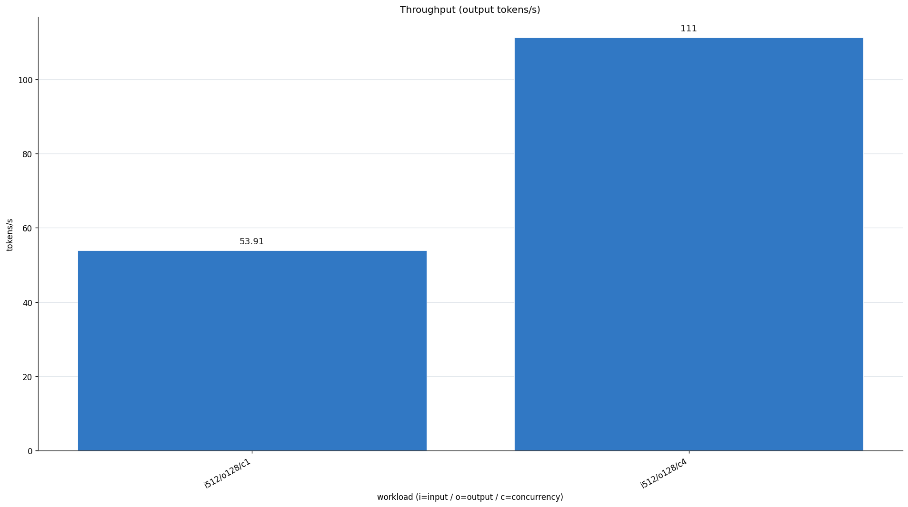

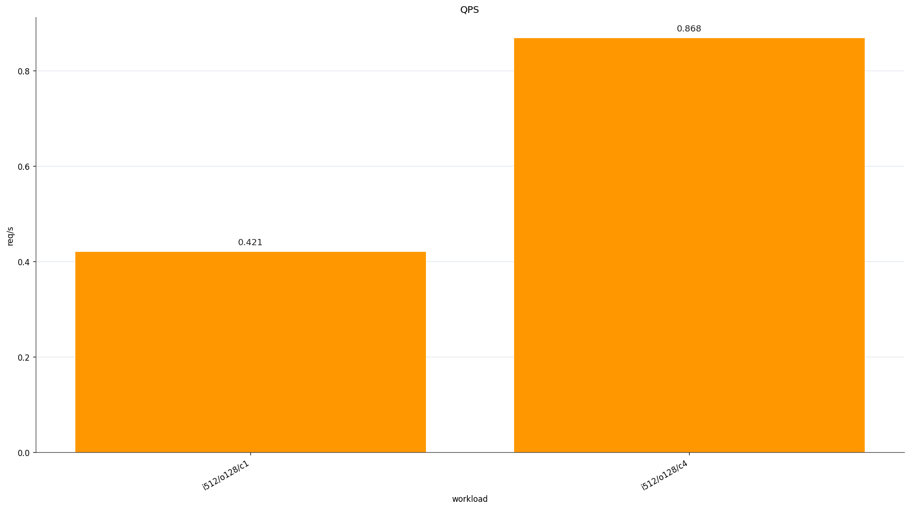

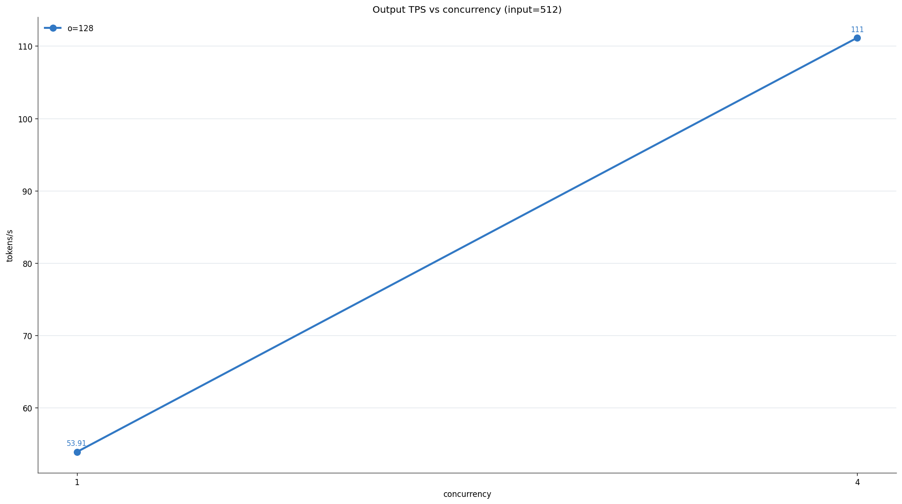

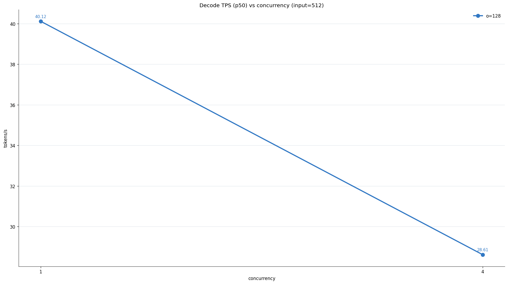

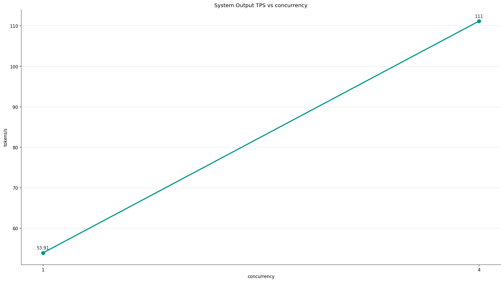

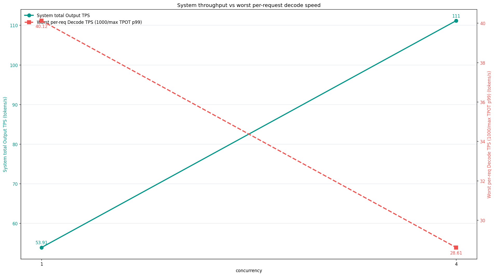

| workload | Output TPS | Input TPS | QPS |
|---|---:|---:|---:|
| `i512/o128/c1` | `53.905` | `215.62` | `0.421` |
| `i512/o128/c4` | `111.149` | `444.597` | `0.868` |

### Decode / Prefill 速度 (按 workload)

| workload | Decode p50 | Decode p99 | Prefill mean | Prefill p99 |
|---|---:|---:|---:|---:|
| `i512/o128/c1` | `65.364` | `40.124` | `2637.502` | `3156.302` |
| `i512/o128/c4` | `35.153` | `28.613` | `820.83` | `1977.9` |

### 时延 (按 workload)

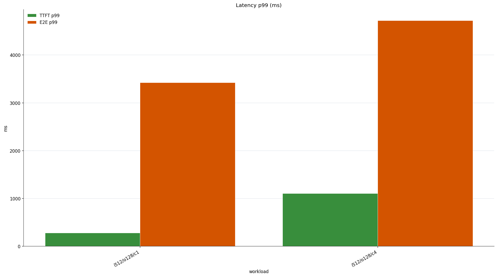

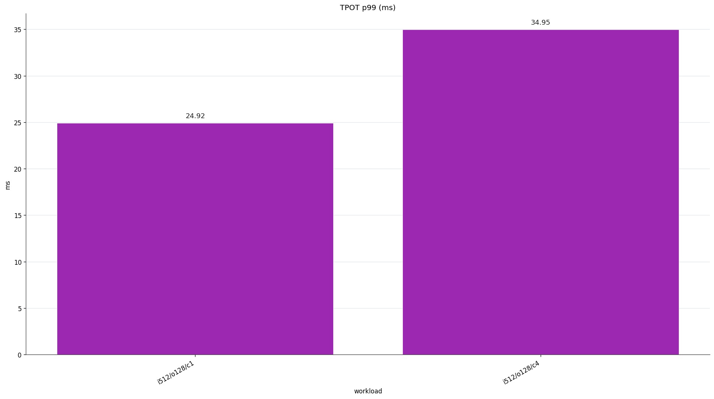

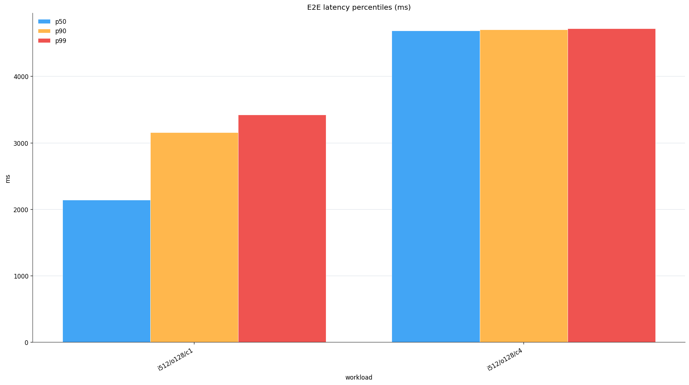

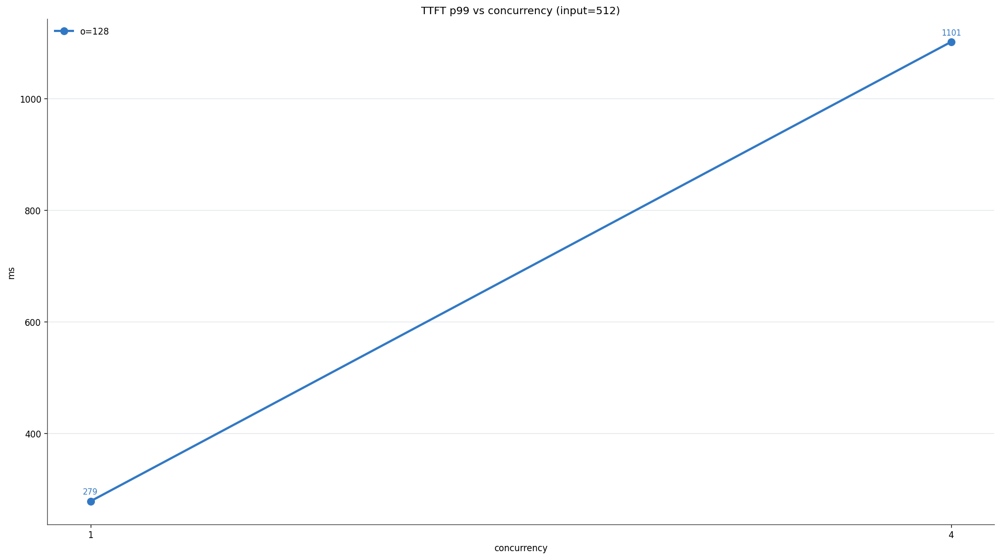

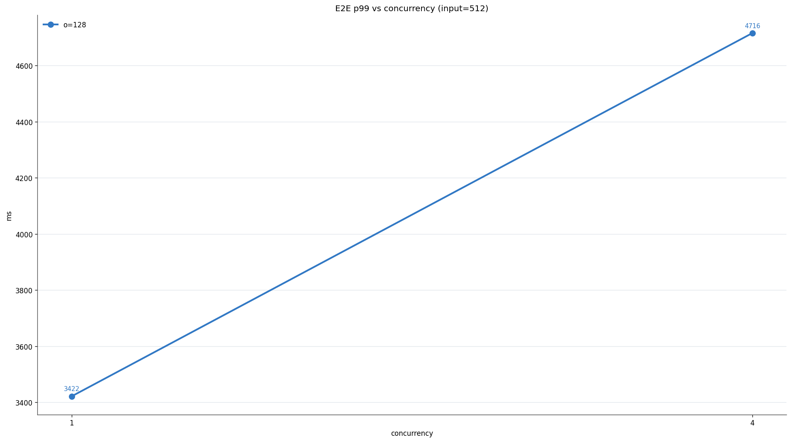

| workload | TTFT p50 | TTFT p90 | TTFT p99 | TPOT p50 | TPOT p90 | TPOT p99 | E2E p50 | E2E p90 | E2E p99 |
|---|---:|---:|---:|---:|---:|---:|---:|---:|---:|
| `i512/o128/c1` | `193.69` | `239.252` | `278.625` | `15.299` | `22.976` | `24.923` | `2139.048` | `3157.17` | `3421.644` |
| `i512/o128/c4` | `1049.991` | `1095.32` | `1101.412` | `28.447` | `34.654` | `34.949` | `4687.663` | `4702.665` | `4715.73` |

## GPU 与显存

采集到 `464` 条 GPU 采样，原始数据见 `metrics.gpu.jsonl`。

| metric | value | unit |
|---|---:|---|
| Util Avg | `49.422` | % |
| Util Max | `100` | % |
| Mem Avg | `19460.931` | MiB |
| Mem Peak | `23118` | MiB |
| Temp Avg | `67.741` | °C |
| Temp Max | `94` | °C |
| Power Avg | `178.284` | W |
| Power Max | `338.42` | W |

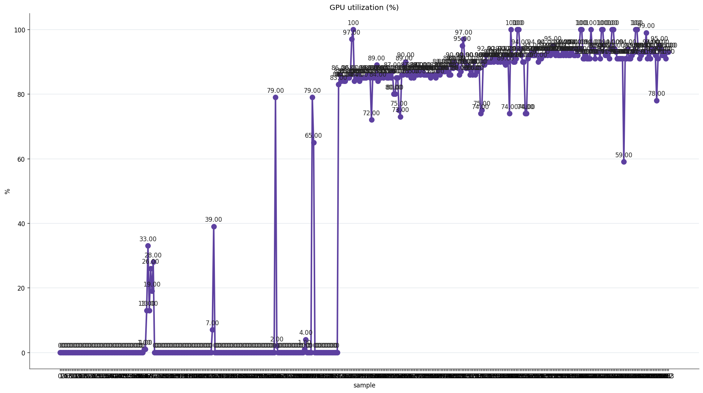

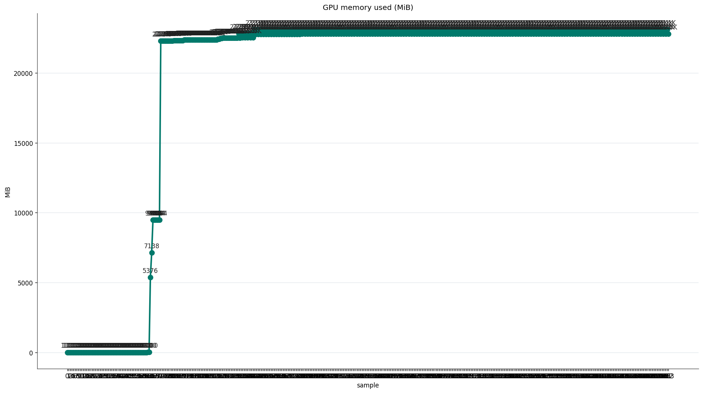

# 三、错误与建议

## 错误与离群点

### 错误概况

- failed_requests: `0`
- timeout_requests: `0`
- oom_count: `0`
- error_categories:
  - (无)

### 启动 / 全局错误

- 无

### 请求级离群点 (E2E 最慢的 5 条)

| request_id | e2e ms | ttft ms | tpot ms | input | output | concurrency |
|---|---:|---:|---:|---:|---:|---:|
| `req_000037` | `4721.3` | `269.3` | `35.05` | `512` | `128` | `4` |
| `req_000041` | `4703.3` | `301.1` | `34.66` | `512` | `128` | `4` |
| `req_000042` | `4703.0` | `1089.7` | `28.45` | `512` | `128` | `4` |
| `req_000055` | `4702.7` | `1085.6` | `28.48` | `512` | `128` | `4` |
| `req_000057` | `4702.4` | `293.8` | `34.71` | `512` | `128` | `4` |

## 优化建议

- 未发现明显异常。

# 四、名词解释

- **Output TPS (system)**: 整个推理系统每秒输出的 token 数，大模型领域主指标 (vLLM / SGLang / TRT-LLM 一致)。
- **Decode TPS (per req)**: 单个请求每秒能 decode 多少 token，= `1000 / TPOT(ms)`。用户感受到的「打字速度」。
- **Prefill TPS (per req)**: 单个请求 prefill 阶段的吞吐，= `input_tokens / TTFT(s)`。长上下文 / RAG / Agent 性能的关键。
- **Input TPS**: 整个系统每秒输入的 token 数。
- **TTFT (Time To First Token)**: 发出请求到收到第一个 token 的时延 (prefill + 排队)。
- **TPOT (Time Per Output Token)**: 第一个 token 之后，平均每个输出 token 的时间。
- **E2E**: 单请求端到端时延。
- **QPS**: 每秒成功请求数。在 LLM 场景下不如 Output TPS 直观 (单请求 token 数差异巨大)。
- 说明: `stream=true` 时 TTFT / TPOT 是真实测量；`stream=false` 时 TTFT≈E2E、TPOT 为摊还值。
